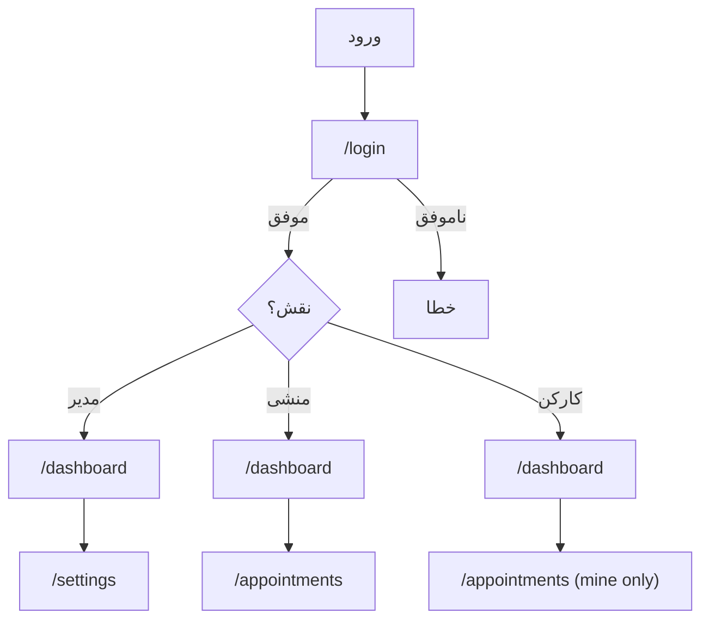
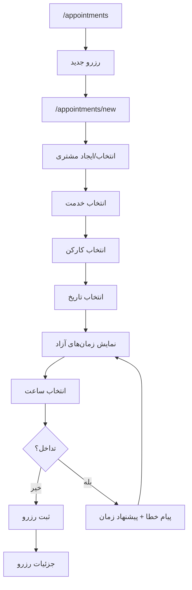
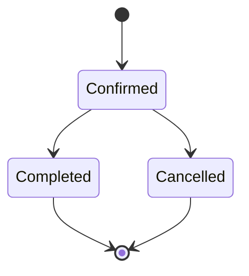
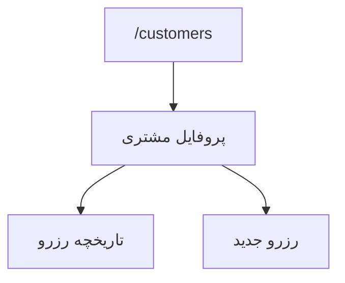
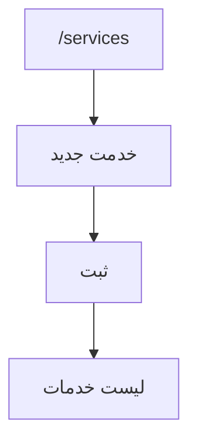
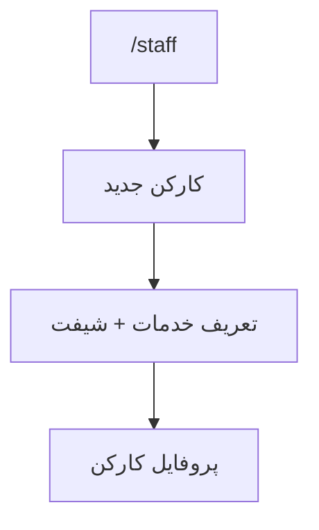
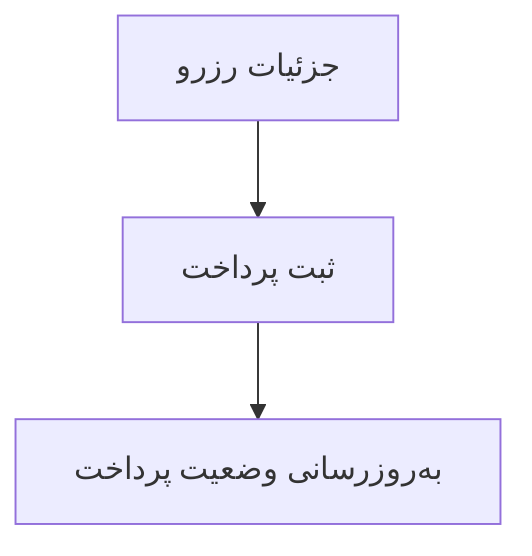
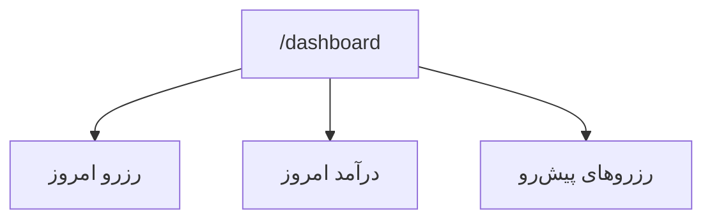

# UI Flow حرفه‌ای — پلتفرم مدیریت سالن (MVP)

نسخه: 0.1  
دامنه: فقط امکانات MVP (رزرو، خدمات، کارکنان، مشتریان، مالی پایه، داشبورد پایه، تنظیمات حداقلی، نقش‌ها)

---

## 0) نقش‌ها و سطح دسترسی (MVP)

- **مدیر**: دسترسی کامل به همه ماژول‌ها + تنظیمات
- **منشی**: رزرو، مشتری، پرداخت + مشاهده داشبورد پایه
- **کارکن**: فقط مشاهده برنامه و رزروهای خودش (Read-only)

---

## 1) نقشه صفحات (Information Architecture)

### صفحات عمومی
- /login
- /forgot-password (اختیاری MVP)
- /403
- /404

### صفحات پنل (Authenticated)
- /dashboard

#### رزرو
- /appointments
- /appointments/calendar
- /appointments/new
- /appointments/:id
- /appointments/:id/edit

#### مشتریان
- /customers
- /customers/new
- /customers/:id
- /customers/:id/edit

#### خدمات
- /services
- /services/new
- /services/:id/edit

#### کارکنان
- /staff
- /staff/new
- /staff/:id
- /staff/:id/edit

#### مالی
- /finance
- /finance/reports/daily
- /finance/reports/monthly

#### تنظیمات (فقط مدیر)
- /settings
- /settings/salon
- /settings/hours
- /settings/rules

---

## 2) ناوبری و الگوهای UI (MVP)

- Sidebar:
  - داشبورد
  - رزروها
  - مشتریان
  - خدمات
  - کارکنان
  - مالی
  - تنظیمات (مدیر)

- الگوی CRUD:
  - List (Table + Search)
  - Create / Edit (Form)
  - Detail (Summary + Actions)

- Stateها:
  - Loading / Empty / Error
  - Empty State با CTA واضح

---

## 3) Flow ورود و نقش‌ها

---

## 4) Flow رزرو (Core)

---

## 5) وضعیت رزرو

---

## 6) Flow مشتریان

---

## 7) Flow خدمات

---

## 8) Flow کارکنان

---

## 9) Flow مالی پایه

---

## 10) داشبورد پایه

---

## 11) Guardrails UX

- جستجوی سریع مشتری با شماره
- جلوگیری از تداخل رزرو
- نمایش فقط زمان‌های مجاز
- محدودیت دسترسی بر اساس نقش

---

## 12) MVP Starter Pages

- Login
- Dashboard
- Appointments (List, Calendar, New, Detail, Edit)
- Customers (List, New, Detail, Edit)
- Services (List, New, Edit)
- Staff (List, New, Profile, Edit)
- Finance (Overview, Daily, Monthly)
- Settings (Salon, Hours, Rules)
