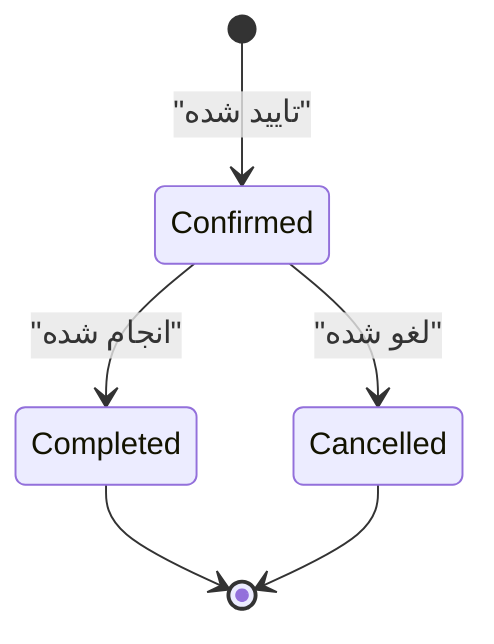
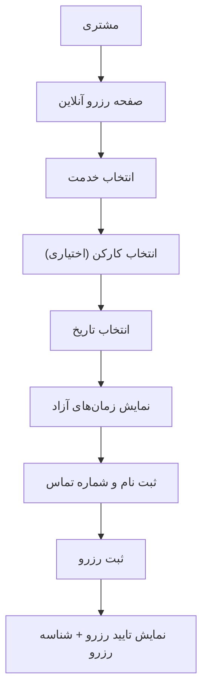
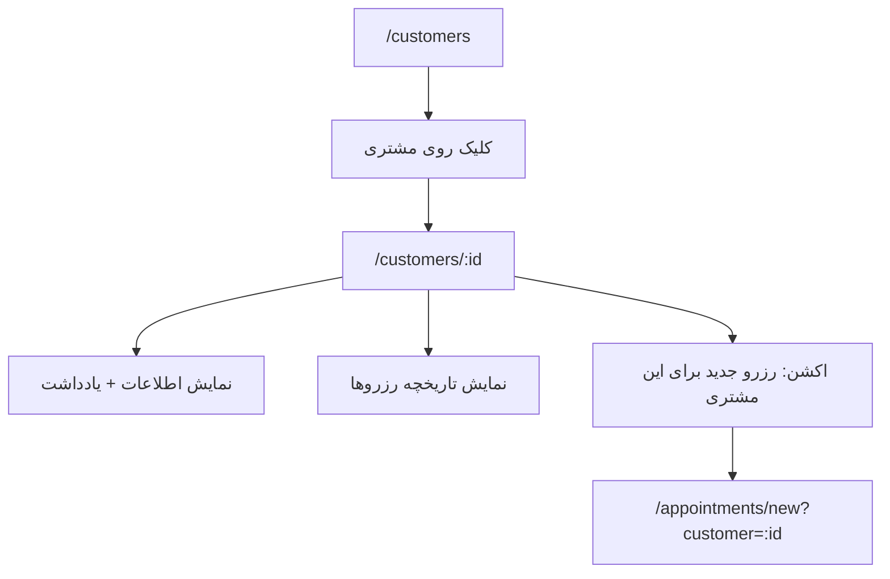
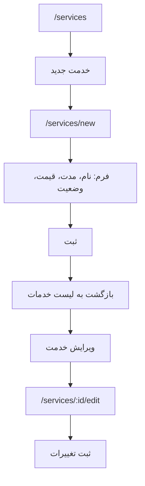
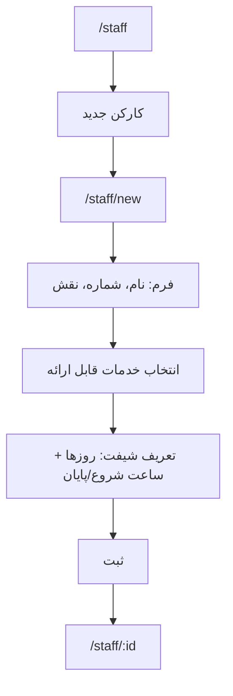
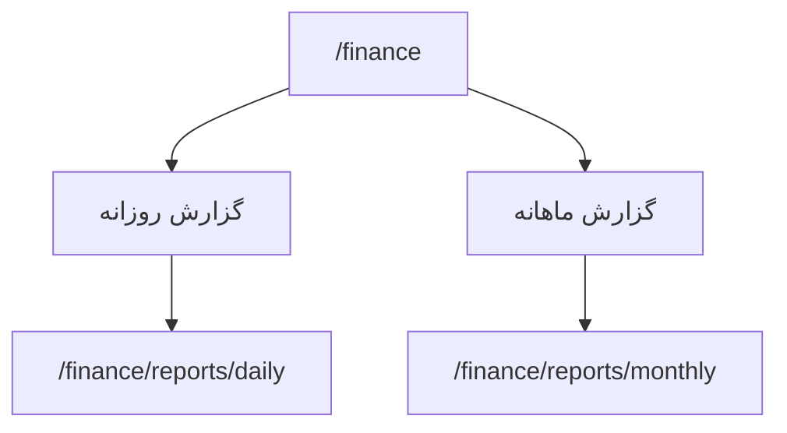
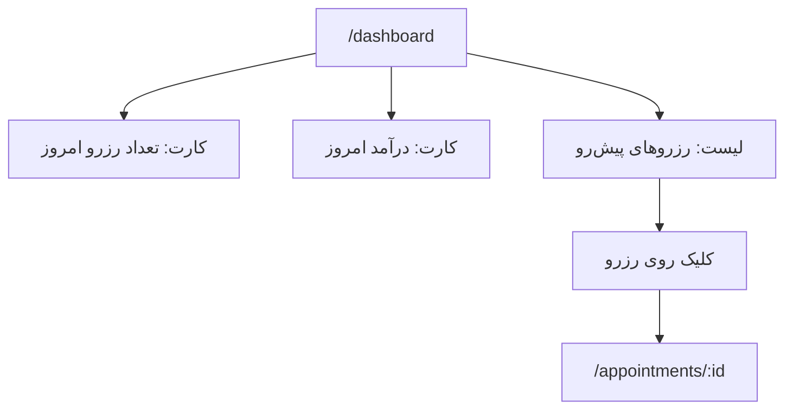
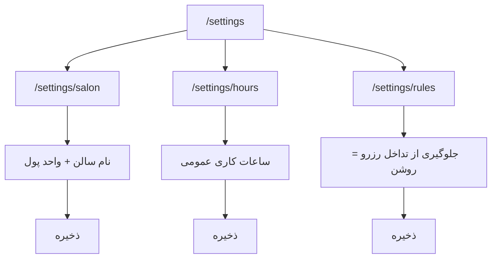

مشکل از خود «محتوا» نیست؛ از **سینتکس Mermaid داخل Markdown**ه. چند تا ایراد رایج باعث این خطاها شده:

1. **بلوک mermaid اول بسته نشده** (``` رو نبستی)، برای همین بقیه متن هم جزو نمودار حساب شده.
2. در Mermaid بعضی کاراکترها داخل `[]` دردسرساز می‌شن، مخصوصاً وقتی متن با `/` شروع می‌کند یا `:` و `()` زیاد دارد. راه‌حل استاندارد: **برچسب‌ها را داخل کوتیشن بگذاریم** مثل `A["/dashboard ..."]`.
3. متن فارسی داخل نودها مشکلی ندارد، ولی بهتر است کوتیشن داشته باشد تا parser گیر ندهد.

در ادامه یک نسخه **اصلاح‌شده و رندرپذیر** از همان UI Flow را می‌دهم (فقط Mermaidها را حرفه‌ای و استاندارد کردم):

---

````md
# UI Flow حرفه‌ای — پلتفرم مدیریت سالن (MVP)
نسخه: 0.1  
دامنه: فقط امکانات MVP

---

## 3) Flow کلی ورود و تعیین مسیر نقش‌ها

```mermaid
flowchart TD
    A["ورود به سیستم"] --> B["/login"]
    B -->|موفق| C{ "نقش کاربر؟" }
    B -->|ناموفق| E["نمایش خطا + تلاش مجدد"]

    C -->|مدیر| D1["/dashboard (مدیر)"]
    C -->|منشی| D2["/dashboard (منشی)"]
    C -->|کارکن| D3["/dashboard (کارکن - محدود)"]

    D1 --> S1["/settings (مدیر)"]
    D2 --> AP1["/appointments"]
    D3 --> MY1["/appointments?filter=mine"]
````

---

## 4) Flow حرفه‌ای رزرو (Core)

### 4.1 ایجاد رزرو توسط منشی (Happy Path)

```mermaid
flowchart TD
    A["/dashboard یا /appointments"] --> B["کلیک: رزرو جدید"]
    B --> C["/appointments/new"]
    C --> D["انتخاب مشتری یا ایجاد مشتری جدید"]
    D --> E["انتخاب خدمت"]
    E --> F["انتخاب کارکن (اختیاری)"]
    F --> G["انتخاب تاریخ"]
    G --> H["نمایش زمان‌های آزاد (بر اساس شیفت + مدت خدمت)"]
    H --> I["انتخاب ساعت"]
    I --> J{ "تداخل دارد؟" }
    J -->|خیر| K["ثبت رزرو"]
    K --> L["/appointments/:id (جزئیات رزرو)"]
    L --> M["اکشن: ثبت پرداخت (اختیاری)"]
    M --> N["ثبت پرداخت + تغییر وضعیت پرداخت"]
```

### 4.2 مسیر خطا: تداخل زمانی

```mermaid
flowchart TD
    A["/appointments/new"] --> B["انتخاب ساعت"]
    B --> C{ "تداخل با رزرو دیگر؟" }
    C -->|بله| D["نمایش خطا + پیشنهاد نزدیک‌ترین زمان‌های آزاد"]
    D --> E["انتخاب زمان جدید"]
    E --> C
    C -->|خیر| F["ثبت رزرو"]
```

### 4.3 تغییر وضعیت رزرو (MVP)



---

## 5) Flow رزرو آنلاین (MVP ساده)



---

## 6) Flow مشتریان (CRM پایه)

### 6.1 ایجاد مشتری از داخل رزرو

```mermaid
flowchart TD
    A["/appointments/new"] --> B["جستجوی شماره/نام مشتری"]
    B --> C{ "مشتری موجود است؟" }
    C -->|بله| D["انتخاب مشتری"]
    C -->|خیر| E["کلیک: ایجاد مشتری"]
    E --> F["/customers/new (مودال/صفحه)"]
    F --> G["ثبت مشتری"]
    G --> H["بازگشت به رزرو جدید + انتخاب خودکار مشتری"]
```

### 6.2 پروفایل مشتری



---

## 7) Flow خدمات



---

## 8) Flow کارکنان + شیفت ساده



---

## 9) Flow مالی پایه

### 9.1 ثبت پرداخت از جزئیات رزرو

```mermaid
flowchart TD
    A["/appointments/:id"] --> B["اکشن: ثبت پرداخت"]
    B --> C["فرم: مبلغ + وضعیت پرداخت"]
    C --> D{ "اعتبارسنجی مبلغ" }
    D -->|اوکی| E["ثبت"]
    D -->|خطا| F["نمایش خطا + اصلاح"]
    E --> G["به‌روزرسانی وضعیت پرداخت"]
```

### 9.2 گزارش روزانه/ماهانه



---

## 10) Flow داشبورد پایه



---

## 11) Flow تنظیمات حداقلی (فقط مدیر)



```

---

اگر می‌خوای حرفه‌ای‌ترش کنیم (برای اینکه تو GitHub/Notion/Docs هم همیشه رندر بشه)، من می‌تونم:
- همه Mermaidها را **با استایل و Subgraph** (تفکیک ماژول‌ها) بازنویسی کنم،
- یا خروجی را به قالب **UX-SPEC-MVP-FA.md** یکپارچه تبدیل کنم (SiteMap + Flow + Wireframe Spec).

بگو این فایل رو قراره کجا رندر کنید؟ GitHub؟ Notion؟ یا داخل ابزار داخلی؟ (هر کدوم quirks خودش رو داره.)
```
