# UI Flow حرفه‌ای — پلتفرم مدیریت سالن (MVP)

نسخه: 0.1  
دامنه: فقط امکانات MVP (رزرو، خدمات، کارکنان، مشتریان، مالی پایه، داشبورد پایه، تنظیمات حداقلی، نقش‌ها)

---

## 0) نقش‌ها و سطح دسترسی (MVP)

- **مدیر**: دسترسی کامل به همه ماژول‌ها + تنظیمات
- **منشی**: رزرو، مشتری، پرداخت + مشاهده داشبورد پایه
- **کارکن**: فقط مشاهده برنامه و رزروهای خودش (Read-only)

---

## 1) نقشه صفحات (Information Architecture)

### صفحات عمومی
- /login
- /forgot-password (اختیاری MVP)
- /403
- /404

### صفحات پنل (Authenticated)
- /dashboard

#### رزرو
- /appointments
- /appointments/calendar
- /appointments/new
- /appointments/:id
- /appointments/:id/edit

#### مشتریان
- /customers
- /customers/new
- /customers/:id
- /customers/:id/edit

#### خدمات
- /services
- /services/new
- /services/:id/edit

#### کارکنان
- /staff
- /staff/new
- /staff/:id
- /staff/:id/edit

#### مالی
- /finance
- /finance/reports/daily
- /finance/reports/monthly

#### تنظیمات (فقط مدیر)
- /settings
- /settings/salon
- /settings/hours
- /settings/rules

---

## 2) ناوبری و الگوهای UI (MVP)

- Sidebar:
  - داشبورد
  - رزروها
  - مشتریان
  - خدمات
  - کارکنان
  - مالی
  - تنظیمات (مدیر)

- الگوی CRUD:
  - List (Table + Search)
  - Create / Edit (Form)
  - Detail (Summary + Actions)

- Stateها:
  - Loading / Empty / Error
  - Empty State با CTA واضح

---

## 3) Flow ورود و نقش‌ها

```mermaid
flowchart TD
    A["ورود"] --> B["/login"]
    B -->|موفق| C{نقش؟}
    B -->|ناموفق| E["خطا"]
    C -->|مدیر| D1["/dashboard"]
    C -->|منشی| D2["/dashboard"]
    C -->|کارکن| D3["/dashboard"]
    D1 --> S1["/settings"]
    D2 --> AP1["/appointments"]
    D3 --> MY1["/appointments (mine only)"]
```

---

## 4) Flow رزرو (Core)

```mermaid
flowchart TD
    A["/appointments"] --> B["رزرو جدید"]
    B --> C["/appointments/new"]
    C --> D["انتخاب/ایجاد مشتری"]
    D --> E["انتخاب خدمت"]
    E --> F["انتخاب کارکن"]
    F --> G["انتخاب تاریخ"]
    G --> H["نمایش زمان‌های آزاد"]
    H --> I["انتخاب ساعت"]
    I --> J{تداخل؟}
    J -->|خیر| K["ثبت رزرو"]
    J -->|بله| X["پیام خطا + پیشنهاد زمان"]
    X --> H
    K --> L["جزئیات رزرو"]
```

---

## 5) وضعیت رزرو

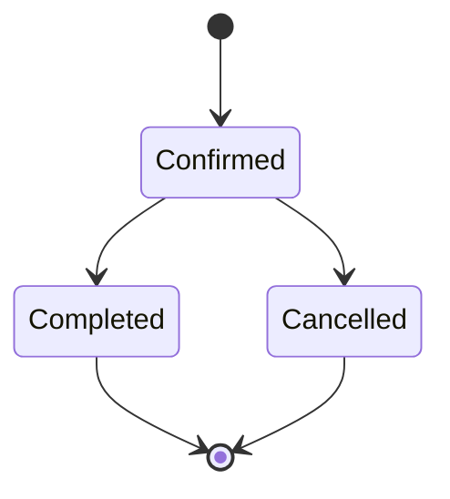

---

## 6) Flow مشتریان

```mermaid
flowchart TD
    A["/customers"] --> B["پروفایل مشتری"]
    B --> C["تاریخچه رزرو"]
    B --> D["رزرو جدید"]
```

---

## 7) Flow خدمات

```mermaid
flowchart TD
    A["/services"] --> B["خدمت جدید"]
    B --> C["ثبت"]
    C --> D["لیست خدمات"]
```

---

## 8) Flow کارکنان

```mermaid
flowchart TD
    A["/staff"] --> B["کارکن جدید"]
    B --> C["تعریف خدمات + شیفت"]
    C --> D["پروفایل کارکن"]
```

---

## 9) Flow مالی پایه

```mermaid
flowchart TD
    A["جزئیات رزرو"] --> B["ثبت پرداخت"]
    B --> C["به‌روزرسانی وضعیت پرداخت"]
```

---

## 10) داشبورد پایه

```mermaid
flowchart TD
    A["/dashboard"] --> B["رزرو امروز"]
    A --> C["درآمد امروز"]
    A --> D["رزروهای پیش‌رو"]
```

---

## 11) Guardrails UX

- جستجوی سریع مشتری با شماره
- جلوگیری از تداخل رزرو
- نمایش فقط زمان‌های مجاز
- محدودیت دسترسی بر اساس نقش

---

## 12) MVP Starter Pages

- Login
- Dashboard
- Appointments (List, Calendar, New, Detail, Edit)
- Customers (List, New, Detail, Edit)
- Services (List, New, Edit)
- Staff (List, New, Profile, Edit)
- Finance (Overview, Daily, Monthly)
- Settings (Salon, Hours, Rules)- `/appointments/calendar` تقویم رزرو
- `/appointments/new` ایجاد رزرو
- `/appointments/:id` جزئیات رزرو
- `/appointments/:id/edit` ویرایش رزرو (پیشنهاد: در MVP باشد)

#### مشتریان (CRM پایه)
- `/customers` لیست مشتریان
- `/customers/new` مشتری جدید
- `/customers/:id` پروفایل مشتری (تاریخچه رزروها + یادداشت)
- `/customers/:id/edit` ویرایش مشتری

#### خدمات
- `/services` لیست خدمات
- `/services/new` خدمت جدید
- `/services/:id/edit` ویرایش خدمت

#### کارکنان
- `/staff` لیست کارکنان
- `/staff/new` کارکن جدید
- `/staff/:id` پروفایل کارکن (خدمات + شیفت ساده)
- `/staff/:id/edit` ویرایش کارکن

#### مالی پایه
- `/finance` نمای کلی مالی
- `/finance/reports/daily` گزارش روزانه
- `/finance/reports/monthly` گزارش ماهانه

#### تنظیمات حداقلی (فقط مدیر)
- `/settings/salon` نام سالن + واحد پول
- `/settings/hours` ساعات کاری عمومی
- `/settings/rules` قوانین رزرو (جلوگیری از تداخل = روشن)

---

## 2) استانداردهای ناوبری و الگوهای UI (MVP)

### ناوبری اصلی (Sidebar / Tab)
- داشبورد
- رزروها
- مشتریان
- خدمات
- کارکنان
- مالی
- تنظیمات (فقط مدیر)

### الگوی صفحات CRUD
- لیست (Table + Search ساده)
- ایجاد/ویرایش (Form)
- جزئیات (Summary + Actions)

### وضعیت‌ها (State)
- Loading / Empty / Error
- Empty State باید CTA واضح داشته باشد (مثلاً «رزرو جدید بساز»)

---

## 3) Flow کلی ورود و مسیر نقش‌ها (GitHub-friendly Mermaid)

```mermaid
flowchart TD
    A["ورود به سیستم"] --> B["/login"]
    B -->|موفق| C{نقش کاربر؟}
    B -->|ناموفق| E["نمایش خطا + تلاش مجدد"]

    C -->|مدیر| D1["/dashboard (مدیر)"]
    C -->|منشی| D2["/dashboard (منشی)"]
    C -->|کارکن| D3["/dashboard (کارکن - محدود)"]

    D1 --> S1["/settings (مدیر)"]
    D2 --> AP1["/appointments"]
    D3 --> MY1["/appointments?filter=mine"]
````

---

## 4) Flow رزرو (Core)

### 4.1 ایجاد رزرو توسط منشی (Happy Path + تداخل)

```mermaid
flowchart TD
    A["/dashboard یا /appointments"] --> B["کلیک: رزرو جدید"]
    B --> C["/appointments/new"]
    C --> D["انتخاب مشتری یا ایجاد مشتری جدید"]
    D --> E["انتخاب خدمت"]
    E --> F["انتخاب کارکن (اختیاری)"]
    F --> G["انتخاب تاریخ"]
    G --> H["نمایش زمان‌های آزاد (بر اساس شیفت + مدت خدمت)"]
    H --> I["انتخاب ساعت"]
    I --> J{تداخل دارد؟}
    J -->|خیر| K["ثبت رزرو"]
    J -->|بله| X["نمایش خطا + پیشنهاد زمان‌های آزاد/نزدیک"]
    X --> H
    K --> L["/appointments/:id (جزئیات رزرو)"]
    L --> M["اکشن: ثبت پرداخت (اختیاری)"]
    M --> N["ثبت پرداخت + تغییر وضعیت پرداخت"]
```

### 4.2 تغییر وضعیت رزرو (MVP)

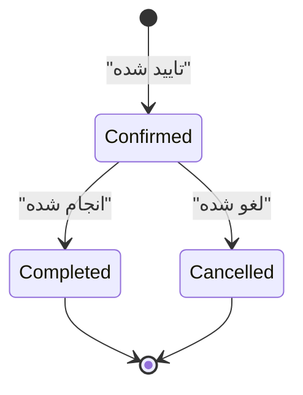

---

## 5) Flow رزرو آنلاین (MVP ساده)

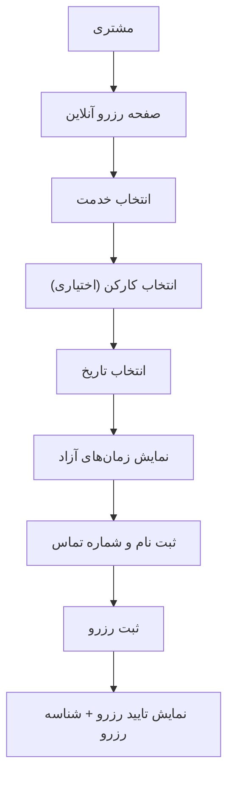

---

## 6) Flow مشتریان (CRM پایه)

### 6.1 ایجاد مشتری از داخل رزرو (Inline Create)

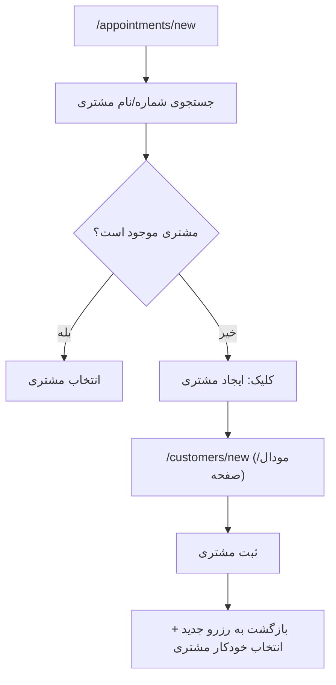

### 6.2 پروفایل مشتری

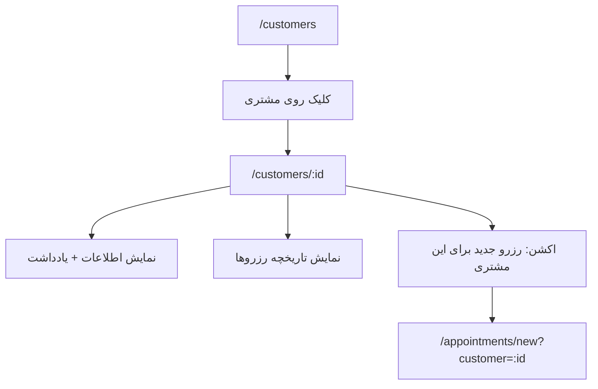

---

## 7) Flow خدمات (Service Management)

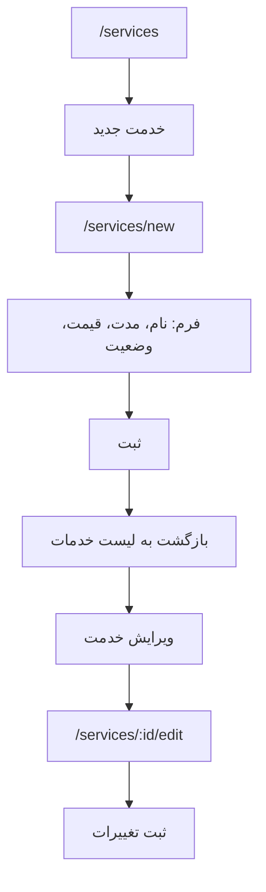

> ستون‌های لیست خدمات (پیشنهادی): نام | مدت | قیمت | وضعیت | عملیات

---

## 8) Flow کارکنان + شیفت ساده

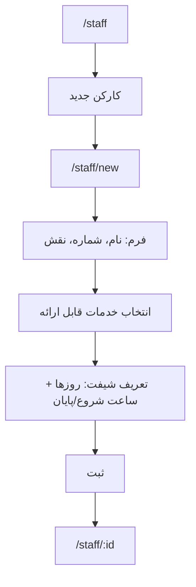

---

## 9) Flow مالی پایه (ثبت پرداخت + گزارش)

### 9.1 ثبت پرداخت از جزئیات رزرو

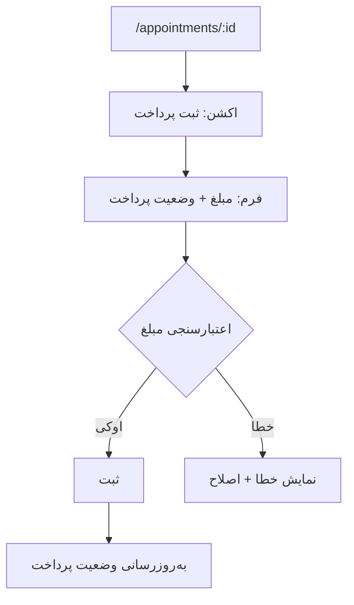

### 9.2 گزارش روزانه/ماهانه

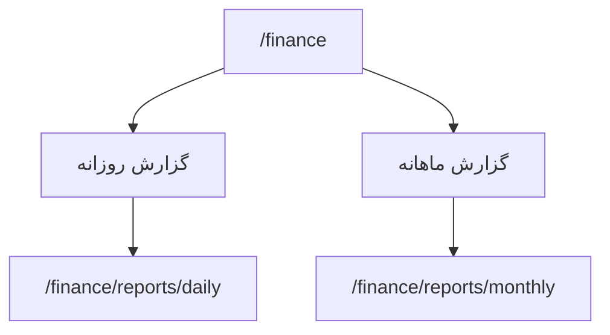

---

## 10) Flow داشبورد پایه (Numbers-first)

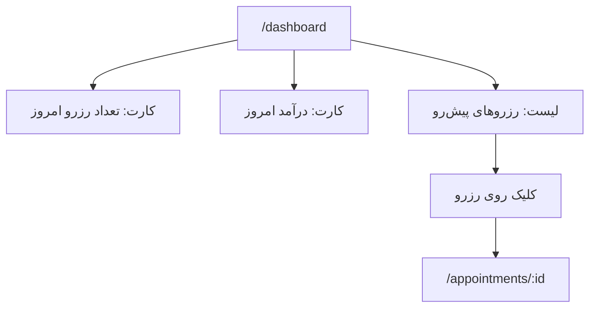

---

## 11) Flow تنظیمات حداقلی (فقط مدیر)

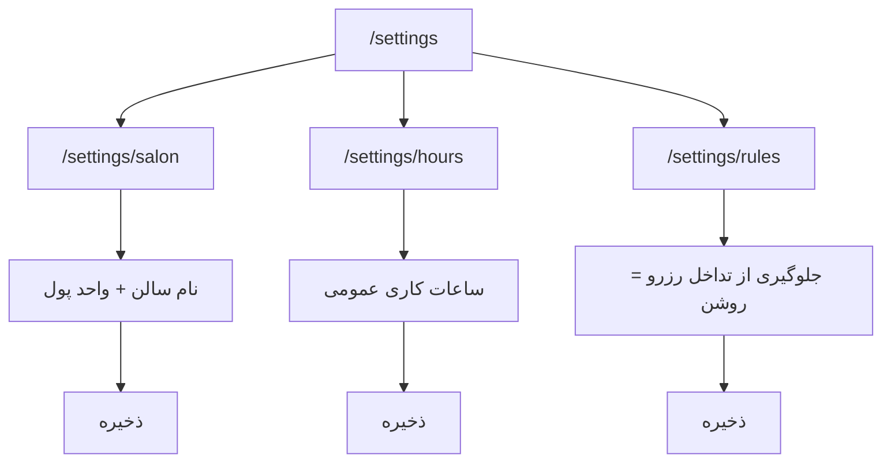

---

## 12) Guardrails (چک‌لیست UX برای MVP)

### رزرو

* جستجوی سریع مشتری (با شماره موبایل)
* نمایش فقط زمان‌های مجاز (ترجیحاً به‌جای انتخاب آزاد و خطا)
* پیام واضح تداخل + پیشنهاد زمان‌های نزدیک

### لیست‌ها

* Search ساده در: رزروها، مشتریان، خدمات، کارکنان
* Empty State با CTA

### نقش‌ها

* کارکن فقط رزروهای خودش را ببیند (Read-only)
* منشی به تنظیمات دسترسی نداشته باشد

---

## 13) حداقل صفحات ضروری برای شروع توسعه (MVP Starter Set)

* Login
* Dashboard
* Appointments: List + Calendar + New + Detail + Edit
* Customers: List + New + Detail + Edit
* Services: List + New + Edit
* Staff: List + New + Profile + Edit
* Finance: Overview + Daily + Monthly
* Settings (Admin-only): Salon + Hours + Rules
