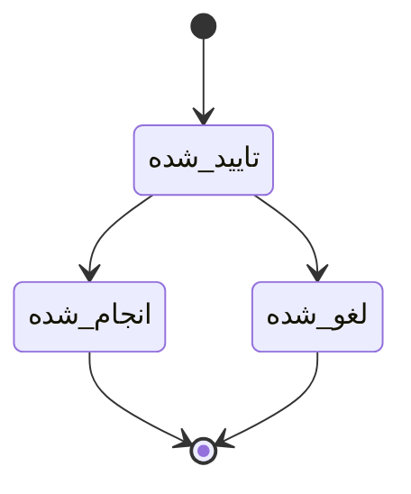

````md
# UI Flow حرفه‌ای — پلتفرم مدیریت سالن (MVP)
نسخه: 0.1  
دامنه: فقط امکانات MVP (رزرو، خدمات، کارکنان، مشتریان، مالی پایه، داشبورد پایه، تنظیمات حداقلی، نقش‌ها)

---

## 0) نقش‌ها و سطح دسترسی (MVP)

- **مدیر**: دسترسی کامل به همه ماژول‌ها + تنظیمات
- **منشی**: رزرو/مشتری/پرداخت + مشاهده داشبورد پایه
- **کارکن**: مشاهده برنامه خودش + مشاهده رزروهای خودش (در MVP: فقط Read)

---

## 1) نقشه صفحات (Information Architecture / Sitemap)

### صفحات عمومی
- `/login` ورود
- `/forgot-password` (اختیاری MVP)
- `/403` عدم دسترسی
- `/404` صفحه وجود ندارد

### صفحات داخل پنل (Authenticated)
- `/dashboard` داشبورد پایه

#### رزرو
- `/appointments` لیست رزروها
- `/appointments/calendar` تقویم رزرو
- `/appointments/new` ایجاد رزرو
- `/appointments/:id` جزئیات رزرو
- `/appointments/:id/edit` ویرایش رزرو (اختیاری MVP، پیشنهاد: بله)

#### مشتریان (CRM پایه)
- `/customers` لیست مشتریان
- `/customers/new` مشتری جدید
- `/customers/:id` پروفایل مشتری (تاریخچه رزروها + یادداشت)
- `/customers/:id/edit` ویرایش مشتری

#### خدمات
- `/services` لیست خدمات
- `/services/new` خدمت جدید
- `/services/:id/edit` ویرایش خدمت

#### کارکنان
- `/staff` لیست کارکنان
- `/staff/new` کارکن جدید
- `/staff/:id` پروفایل کارکن (خدمات + شیفت ساده)
- `/staff/:id/edit` ویرایش کارکن

#### مالی پایه
- `/finance` نمای کلی مالی (روزانه/ماهانه)
- `/finance/reports/daily` گزارش روزانه
- `/finance/reports/monthly` گزارش ماهانه

#### تنظیمات حداقلی (فقط مدیر)
- `/settings/salon` نام سالن + واحد پول
- `/settings/hours` ساعات کاری عمومی
- `/settings/rules` قوانین رزرو (جلوگیری از تداخل = روشن)

---

## 2) استانداردهای ناوبری و الگوهای UI (MVP)

### ناوبری اصلی (Sidebar / Tab)
- داشبورد
- رزروها
- مشتریان
- خدمات
- کارکنان
- مالی
- تنظیمات (فقط مدیر)

### الگوی صفحات CRUD
- لیست (Table + Search ساده)
- ایجاد/ویرایش (Form)
- جزئیات (Summary + Actions)

### وضعیت‌ها (State)
- Loading / Empty / Error
- Empty Stateها باید CTA واضح داشته باشند (مثلاً «رزرو جدید بساز»)

---

## 3) Flow کلی ورود و تعیین مسیر نقش‌ها

```mermaid
flowchart TD
    A[ورود به سیستم] --> B[/login]
    B -->|موفق| C{نقش کاربر؟}
    B -->|ناموفق| E[نمایش خطا + تلاش مجدد]

    C -->|مدیر| D1[/dashboard (مدیر)]
    C -->|منشی| D2[/dashboard (منشی)]
    C -->|کارکن| D3[/dashboard (کارکن - محدود)]

    D1 --> S1[/settings (مدیر)]
    D2 --> AP1[/appointments]
    D3 --> MY1[/appointments?filter=mine]
````

---

## 4) Flow حرفه‌ای رزرو (Core) — مسیر اصلی + جلوگیری از تداخل

### 4.1 ایجاد رزرو توسط منشی (Happy Path)

```mermaid
flowchart TD
    A[/dashboard یا /appointments] --> B[کلیک: رزرو جدید]
    B --> C[/appointments/new]
    C --> D[انتخاب مشتری یا ایجاد مشتری جدید]
    D --> E[انتخاب خدمت]
    E --> F[انتخاب کارکن (یا پیش‌فرض/بدون ترجیح - اختیاری)]
    F --> G[انتخاب تاریخ]
    G --> H[نمایش اسلات‌های زمانی آزاد بر اساس شیفت و مدت خدمت]
    H --> I[انتخاب ساعت]
    I --> J{تداخل دارد؟}
    J -->|خیر| K[ثبت رزرو]
    K --> L[/appointments/:id (جزئیات رزرو)]
    L --> M[اکشن: ثبت پرداخت (اختیاری)]
    M --> N[ثبت پرداخت + تغییر وضعیت پرداخت]
```

### 4.2 مسیر خطا: تداخل زمانی

```mermaid
flowchart TD
    A[/appointments/new] --> B[انتخاب ساعت]
    B --> C{تداخل با رزرو دیگر؟}
    C -->|بله| D[نمایش پیام خطا + پیشنهاد نزدیک‌ترین زمان‌های آزاد]
    D --> E[انتخاب زمان جدید]
    E --> C
    C -->|خیر| F[ثبت رزرو]
```

### 4.3 تغییر وضعیت رزرو (MVP)



---

## 5) Flow رزرو آنلاین (نسخه ساده MVP)

> اگر در MVP رزرو آنلاین دارید، همین Flow کافی است (بدون پرداخت آنلاین، بدون گروهی)

```mermaid
flowchart TD
    A[کاربر/مشتری] --> B[صفحه رزرو آنلاین]
    B --> C[انتخاب خدمت]
    C --> D[انتخاب کارکن (اختیاری)]
    D --> E[انتخاب تاریخ]
    E --> F[نمایش زمان‌های آزاد]
    F --> G[وارد کردن نام و شماره تماس]
    G --> H[ثبت رزرو]
    H --> I[نمایش تایید رزرو + کد/شناسه رزرو]
```

---

## 6) Flow مشتریان (CRM پایه)

### 6.1 ایجاد مشتری از داخل رزرو (Inline Create)

```mermaid
flowchart TD
    A[/appointments/new] --> B[جستجوی شماره/نام مشتری]
    B --> C{مشتری موجود است؟}
    C -->|بله| D[انتخاب مشتری]
    C -->|خیر| E[کلیک: ایجاد مشتری]
    E --> F[/customers/new (مودال یا صفحه)]
    F --> G[ثبت مشتری]
    G --> H[بازگشت به رزرو جدید + انتخاب خودکار مشتری]
```

### 6.2 پروفایل مشتری

```mermaid
flowchart TD
    A[/customers] --> B[کلیک روی یک مشتری]
    B --> C[/customers/:id]
    C --> D[نمایش اطلاعات + یادداشت]
    C --> E[نمایش تاریخچه رزروها]
    C --> F[اکشن: رزرو جدید برای این مشتری]
    F --> G[/appointments/new?customer=:id]
```

---

## 7) Flow خدمات (Service Management)

```mermaid
flowchart TD
    A[/services] --> B[خدمت جدید]
    B --> C[/services/new]
    C --> D[فرم: نام، مدت، قیمت، وضعیت]
    D --> E[ثبت]
    E --> F[/services (لیست)]
    F --> G[ویرایش خدمت]
    G --> H[/services/:id/edit]
    H --> I[ثبت تغییرات]
```

نکته UI: در لیست خدمات، ستون‌های پیشنهادی: `نام | مدت | قیمت | وضعیت | عملیات`

---

## 8) Flow کارکنان + شیفت ساده

```mermaid
flowchart TD
    A[/staff] --> B[کارکن جدید]
    B --> C[/staff/new]
    C --> D[فرم: نام، شماره، نقش]
    D --> E[انتخاب خدمات قابل ارائه]
    E --> F[تعریف شیفت ساده: روزها + ساعت شروع/پایان]
    F --> G[ثبت]
    G --> H[/staff/:id]
```

---

## 9) Flow مالی پایه (ثبت پرداخت + گزارش)

### 9.1 ثبت پرداخت از جزئیات رزرو

```mermaid
flowchart TD
    A[/appointments/:id] --> B[اکشن: ثبت پرداخت]
    B --> C[فرم: مبلغ + وضعیت پرداخت]
    C --> D{اعتبارسنجی مبلغ}
    D -->|اوکی| E[ثبت]
    D -->|خطا| F[نمایش خطا + اصلاح]
    E --> G[به‌روزرسانی وضعیت: Paid/Unpaid]
```

### 9.2 گزارش روزانه/ماهانه

```mermaid
flowchart TD
    A[/finance] --> B[انتخاب گزارش روزانه]
    A --> C[انتخاب گزارش ماهانه]
    B --> D[/finance/reports/daily]
    C --> E[/finance/reports/monthly]
    D --> F[نمایش مجموع درآمد + لیست تراکنش‌ها/رزروهای پرداخت‌شده]
    E --> G[نمایش مجموع درآمد ماه + تفکیک روزها]
```

---

## 10) Flow داشبورد پایه (Numbers-first)

```mermaid
flowchart TD
    A[/dashboard] --> B[کارت: تعداد رزرو امروز]
    A --> C[کارت: درآمد امروز]
    A --> D[لیست: رزروهای پیش‌رو]
    D --> E[کلیک روی رزرو]
    E --> F[/appointments/:id]
```

---

## 11) Flow تنظیمات حداقلی (فقط مدیر)

```mermaid
flowchart TD
    A[/settings] --> B[/settings/salon]
    A --> C[/settings/hours]
    A --> D[/settings/rules]

    B --> B1[نام سالن + واحد پول] --> B2[ذخیره]
    C --> C1[ساعات کاری عمومی] --> C2[ذخیره]
    D --> D1[جلوگیری از تداخل رزرو = روشن] --> D2[ذخیره]
```

---

## 12) Guardrails حرفه‌ای (چک‌لیست UX برای MVP)

### رزرو

* جستجوی سریع مشتری (با شماره موبایل)
* در انتخاب زمان، فقط **اسلات‌های مجاز** نمایش داده شود (به‌جای اجازه انتخاب و خطا گرفتن)
* هشدار واضح برای تداخل + پیشنهاد زمان‌های نزدیک

### لیست‌ها

* Search ساده در: رزروها، مشتریان، خدمات، کارکنان
* Empty State با CTA

### دسترسی نقش‌ها

* کارکن فقط رزروهای خودش را ببیند (MVP Read-only)
* منشی دسترسی به تنظیمات نداشته باشد

---

## 13) حداقل صفحات ضروری برای شروع توسعه (MVP Starter Set)

1. Login
2. Dashboard
3. Appointments: List + Calendar + New + Detail
4. Customers: List + New + Detail
5. Services: List + New/Edit
6. Staff: List + New/Edit + Profile(shift)
7. Finance: Overview + Daily + Monthly
8. Settings (Admin-only): Salon + Hours + Rules

```

اگر دوست داری، همین UI Flow را در قدم بعدی به یکی از این‌ها تبدیل می‌کنم (بدون سوال اضافه):
- **Wireframe متنی صفحه‌به‌صفحه** (کامپوننت‌ها و چیدمان هر صفحه)
- **Backlog توسعه Front/Back** بر اساس همین Flow (تسک‌ها + اولویت‌ها)
- **API Contract اولیه** برای رزرو/مشتری/پرداخت (REST یا GraphQL)
- **Schema دیتابیس MVP** (جدول‌ها + روابط)
```
