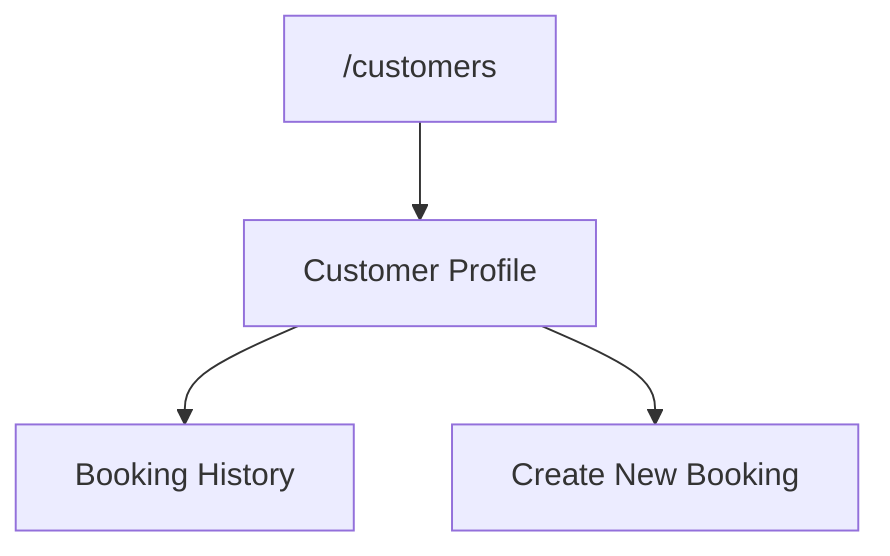
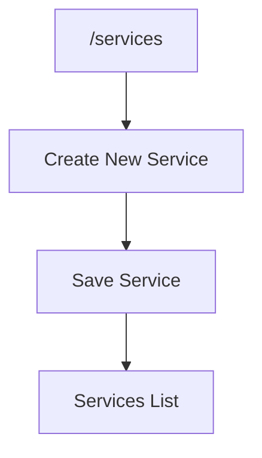
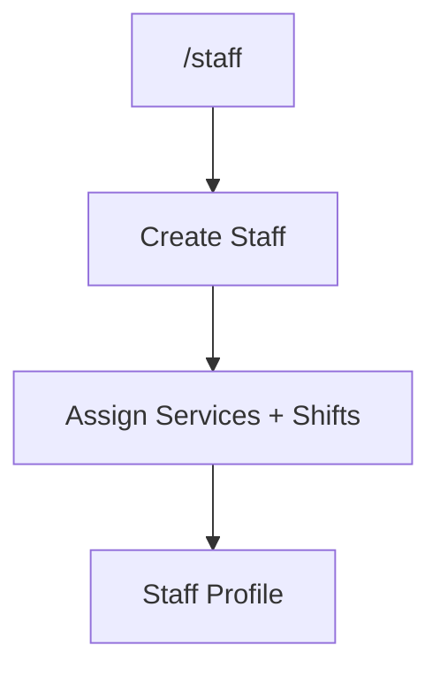
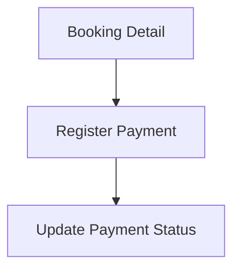
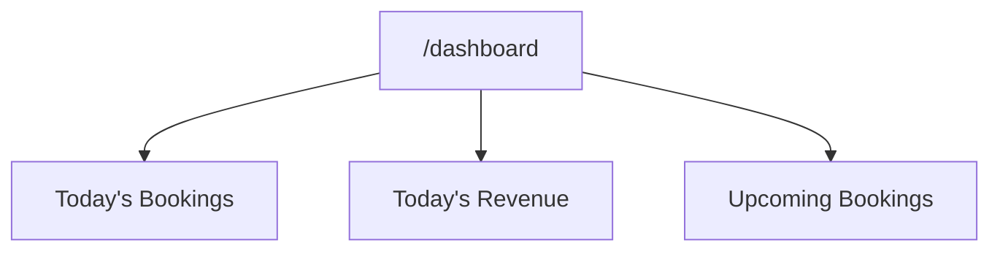

# Salon Management Platform – MVP Flows (v0.2)

This document contains the updated user flows aligned with the current MVP scope and database schema.

---

## 6) Customer Flow

---

## 7) Services Flow

---

## 8) Staff Flow

---

## 9) Basic Finance Flow

---

## 10) Dashboard Flow

---

## 11) UX Guardrails

- Fast customer search by phone number
- Prevent overlapping bookings
- Show only available time slots
- Role-based access control

---

## 12) MVP Starter Pages

- Login
- Dashboard
- Appointments
  - List
  - Calendar
  - New
  - Detail
  - Edit
- Customers
  - List
  - New
  - Detail
  - Edit
- Services
  - List
  - New
  - Edit
- Staff
  - List
  - New
  - Profile
  - Edit
- Finance
  - Overview
  - Daily
  - Monthly
- Settings
  - Salon
  - Working Hours
  - Booking Rules

---

Version: 0.2
Status: MVP – Ready for Implementation

