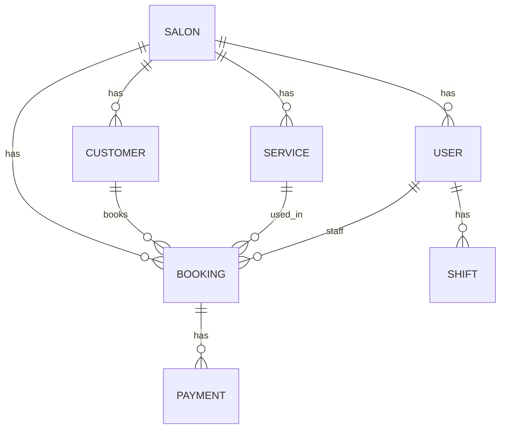

# پلتفرم مدیریت سالن — Database Schema (Prisma)

این فایل برای قرار دادن داخل GitHub طراحی شده تا هم **خوانا** باشد و هم **ظاهر خوب** داشته باشد.

## ER Diagram (Mermaid)

> GitHub این نمودار را رندر می‌کند.



## Prisma Schema (نسخه جدید)

```prisma
// =======================
// Enums
// =======================

enum UserRole { MANAGER RECEPTIONIST STAFF }

enum BookingStatus {
  PENDING
  CONFIRMED
  DONE
  CANCELED
  NO_SHOW
}

enum BookingSource { IN_PERSON ONLINE }

enum PaymentMethod { CASH CARD ONLINE }

enum PaymentStatus { PAID REFUNDED VOID }

enum BookingPaymentState { UNPAID PARTIALLY_PAID PAID REFUNDED OVERPAID }

// =======================
// Models
// =======================

model Salon {
  id        String   @id @default(cuid())
  name      String

  users      User[]
  services   Service[]
  bookings   Booking[]
  shifts     Shift[]
  settings   Settings?
  customers  SalonCustomerProfile[]

  createdAt DateTime @default(now())
  updatedAt DateTime @updatedAt
}

model Settings {
  id        String @id @default(cuid())

  salonId   String @unique
  salon     Salon  @relation(fields: [salonId], references: [id])

  preventOverlaps Boolean @default(true)

  timeZone      String?
  workStartTime String?
  workEndTime   String?

  allowOnlineBooking       Boolean @default(false)
  onlineBookingAutoConfirm Boolean @default(false)

  createdAt DateTime @default(now())
  updatedAt DateTime @updatedAt
}

// -----------------------
// Staff / Panel Users
// -----------------------
model User {
  id           String   @id @default(cuid())

  salonId      String
  salon        Salon    @relation(fields: [salonId], references: [id])

  fullName     String
  phone        String
  passwordHash String
  role         UserRole
  isActive     Boolean  @default(true)

  sessions         Session[]

  shifts           Shift[]
  bookingsAsStaff  Booking[] @relation("BookingStaff")
  bookingsCreated  Booking[] @relation("BookingCreator")
  canceledBookings Booking[] @relation("BookingCanceler")

  // join table (explicit)
  userServices UserService[]

  createdAt DateTime @default(now())
  updatedAt DateTime @updatedAt

  @@unique([salonId, phone])
  @@index([salonId, role])
  @@index([salonId, isActive])
}

model Session {
  id        String   @id @default(cuid())

  userId    String
  user      User     @relation(fields: [userId], references: [id], onDelete: Cascade)

  tokenHash String   @unique
  revokedAt DateTime?
  expiresAt DateTime

  createdAt DateTime @default(now())
  updatedAt DateTime @updatedAt

  @@index([userId, expiresAt])
}

// -----------------------
// Global Customer Identity (cross-salon)
// -----------------------
model CustomerAccount {
  id       String   @id @default(cuid())
  phone    String   @unique
  fullName String?

  profiles SalonCustomerProfile[]
  bookings Booking[]

  createdAt DateTime @default(now())
  updatedAt DateTime @updatedAt

  @@index([phone])
}

// -----------------------
// Per-salon CRM Profile
// -----------------------
model SalonCustomerProfile {
  id                String @id @default(cuid())

  salonId           String
  salon             Salon  @relation(fields: [salonId], references: [id])

  customerAccountId String
  customerAccount   CustomerAccount @relation(fields: [customerAccountId], references: [id], onDelete: Cascade)

  displayName String?
  note        String?

  bookings Booking[]

  createdAt DateTime @default(now())
  updatedAt DateTime @updatedAt

  @@unique([salonId, customerAccountId])
  @@index([salonId, displayName])
  @@index([customerAccountId])
}

// -----------------------
// Services / Shifts
// -----------------------
model Service {
  id              String @id @default(cuid())

  salonId         String
  salon           Salon  @relation(fields: [salonId], references: [id])

  name            String
  durationMinutes Int
  price           Int
  currency        String // NON-NULL (aligned with DBML)
  isActive        Boolean @default(true)

  bookings        Booking[]

  // join table (explicit)
  userServices UserService[]

  createdAt DateTime @default(now())
  updatedAt DateTime @updatedAt

  @@index([salonId, isActive])
  @@index([salonId, name])
}

model UserService {
  userId    String
  serviceId String

  user      User    @relation(fields: [userId], references: [id], onDelete: Cascade)
  service   Service @relation(fields: [serviceId], references: [id], onDelete: Cascade)

  @@id([userId, serviceId])
  @@index([serviceId])
  @@index([userId])
}

model Shift {
  id        String @id @default(cuid())

  salonId   String
  salon     Salon  @relation(fields: [salonId], references: [id])

  userId    String
  user      User   @relation(fields: [userId], references: [id])

  dayOfWeek Int
  startTime String
  endTime   String
  isActive  Boolean @default(true)

  createdAt DateTime @default(now())
  updatedAt DateTime @updatedAt

  @@index([salonId, userId, dayOfWeek])
  @@index([salonId, dayOfWeek])
}

// -----------------------
// Booking
// -----------------------
model Booking {
  id        String @id @default(cuid())

  salonId   String
  salon     Salon  @relation(fields: [salonId], references: [id])

  customerProfileId String
  customerProfile   SalonCustomerProfile @relation(fields: [customerProfileId], references: [id])

  customerAccountId String
  customerAccount   CustomerAccount @relation(fields: [customerAccountId], references: [id])

  serviceId String
  service   Service @relation(fields: [serviceId], references: [id])

  staffId   String
  staff     User @relation("BookingStaff", fields: [staffId], references: [id])

  createdByUserId String
  createdBy       User @relation("BookingCreator", fields: [createdByUserId], references: [id])

  startAt   DateTime @db.Timestamptz(6)
  endAt     DateTime @db.Timestamptz(6)

  // Snapshot (NON-NULL)
  serviceNameSnapshot     String
  serviceDurationSnapshot Int
  servicePriceSnapshot    Int
  currencySnapshot        String

  amountDueSnapshot Int
  paymentState      BookingPaymentState @default(UNPAID)

  status BookingStatus @default(CONFIRMED)
  source BookingSource @default(IN_PERSON)
  note   String?

  canceledAt       DateTime? @db.Timestamptz(6)
  cancelReason     String?
  canceledByUserId String?
  canceledBy       User? @relation("BookingCanceler", fields: [canceledByUserId], references: [id])

  completedAt DateTime? @db.Timestamptz(6)
  noShowAt    DateTime? @db.Timestamptz(6)

  payments Payment[]

  createdAt DateTime @default(now())
  updatedAt DateTime @updatedAt

  @@index([salonId, startAt])
  @@index([salonId, staffId, startAt])
  @@index([salonId, status, startAt])
  @@index([salonId, paymentState, startAt]) // ✅ was missing before
  @@index([customerAccountId, startAt])
  @@index([customerProfileId, startAt])
}

// -----------------------
// Payments
// -----------------------
model Payment {
  id String @id @default(cuid())

  bookingId String
  booking   Booking @relation(fields: [bookingId], references: [id], onDelete: Cascade)

  amount   Int
  currency String

  status PaymentStatus @default(PAID)
  method PaymentMethod
  paidAt  DateTime? @db.Timestamptz(6)

  referenceCode String?

  createdAt DateTime @default(now())
  updatedAt DateTime @updatedAt

  @@index([bookingId, paidAt])
  @@index([status, paidAt])
}


```

## نکات اجرایی کوتاه

- **Snapshotها** (serviceNameSnapshot, servicePriceSnapshot, amountDueSnapshot) را هنگام ساخت رزرو از Service پر کنید.
- **paymentState** را بعد از هر Payment با جمع پرداخت‌ها/ریفاندها به‌روزرسانی کنید.
- **جلوگیری از تداخل رزروها**:
  - MVP: در لایه اپلیکیشن با چک بازه زمانی `[startAt, endAt)` برای همان `staffId`.
  - Production (Postgres): استفاده از *Exclusion Constraint* برای جلوگیری قطعی overlap.
  - db diagram https://dbdiagram.io/d/693e5c1ce877c63074bdfa38
