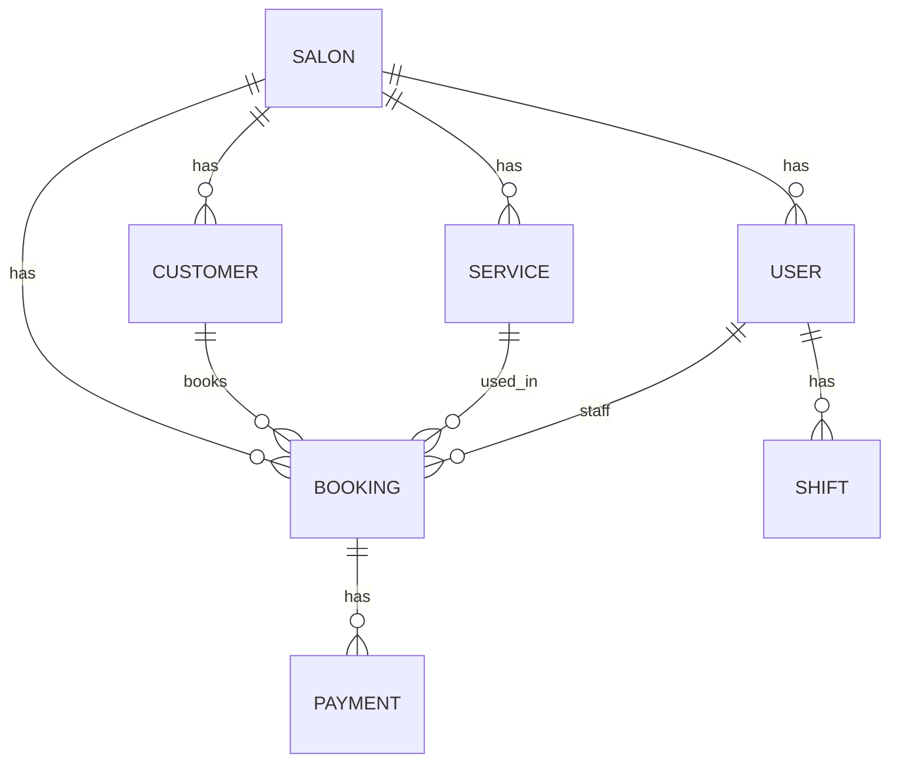

# پلتفرم مدیریت سالن — Database Schema (Prisma)

این فایل برای قرار دادن داخل GitHub طراحی شده تا هم **خوانا** باشد و هم **ظاهر خوب** داشته باشد.

## ER Diagram (Mermaid)

> GitHub این نمودار را رندر می‌کند.



## Prisma Schema (نسخه جدید)

```prisma
// enums
enum UserRole { MANAGER RECEPTIONIST STAFF }

enum BookingStatus {
  PENDING      // درخواست رزرو آنلاین (اختیاری، ولی پیشنهاد می‌شود)
  CONFIRMED
  DONE
  CANCELED
  NO_SHOW
}

enum BookingSource { IN_PERSON ONLINE }

enum PaymentMethod { CASH CARD ONLINE }

// وضعیت هر تراکنش پرداخت
enum PaymentStatus { PAID REFUNDED VOID }

// وضعیت کلی پرداخت روی رزرو (برای MVP مالی خیلی مهم)
enum BookingPaymentState { UNPAID PARTIALLY_PAID PAID REFUNDED OVERPAID }

// =======================
// Models
// =======================

model Salon {
  id        String   @id @default(cuid())
  name      String

  users     User[]
  customers Customer[]
  services  Service[]
  bookings  Booking[]
  shifts    Shift[]
  settings  Settings?

  createdAt DateTime @default(now())
  updatedAt DateTime @updatedAt
}

model Settings {
  id              String @id @default(cuid())
  salonId         String @unique
  salon           Salon  @relation(fields: [salonId], references: [id])

  preventOverlaps Boolean @default(true)

  timeZone        String? // e.g. "Asia/Tehran"
  workStartTime   String? // "09:00" (HH:mm)
  workEndTime     String? // "21:00" (HH:mm)

  // رزرو آنلاین اگر فعال باشد می‌تواند PENDING بسازد
  allowOnlineBooking Boolean @default(false)
  onlineBookingAutoConfirm Boolean @default(false)

  createdAt DateTime @default(now())
  updatedAt DateTime @updatedAt
}

model User {
  id           String   @id @default(cuid())
  salonId      String
  salon        Salon    @relation(fields: [salonId], references: [id])

  fullName     String
  phone        String
  passwordHash String
  role         UserRole
  isActive     Boolean  @default(true)

  // Auth sessions (اگر JWT stateless دارید می‌توانید حذف کنید)
  sessions         Session[]

  shifts           Shift[]
  bookingsAsStaff  Booking[] @relation("BookingStaff")
  bookingsCreated  Booking[] @relation("BookingCreator")
  canceledBookings Booking[] @relation("BookingCanceler")

  services     Service[] @relation("UserServices")

  createdAt    DateTime @default(now())
  updatedAt    DateTime @updatedAt

  @@unique([salonId, phone])
  @@index([salonId, role])
  @@index([salonId, isActive])
}

model Session {
  id        String   @id @default(cuid())
  userId    String
  user      User     @relation(fields: [userId], references: [id], onDelete: Cascade)

  // هش/توکن refresh (ترجیحاً hash ذخیره شود نه raw token)
  tokenHash String   @unique

  revokedAt DateTime?
  expiresAt DateTime

  createdAt DateTime @default(now())
  updatedAt DateTime @updatedAt

  @@index([userId, expiresAt])
}

model Customer {
  id        String @id @default(cuid())
  salonId   String
  salon     Salon  @relation(fields: [salonId], references: [id])

  fullName  String
  phone     String
  note      String?

  bookings  Booking[]

  createdAt DateTime @default(now())
  updatedAt DateTime @updatedAt

  @@unique([salonId, phone])
  @@index([salonId, fullName])
}

model Service {
  id              String @id @default(cuid())
  salonId         String
  salon           Salon  @relation(fields: [salonId], references: [id])

  name            String
  durationMinutes Int
  price           Int       // smallest unit (e.g. Rial)
  currency        String?   // "IRR"

  isActive        Boolean @default(true)

  staff           User[]  @relation("UserServices")
  bookings        Booking[]

  createdAt DateTime @default(now())
  updatedAt DateTime @updatedAt

  @@index([salonId, isActive])
  @@index([salonId, name])
}

model Shift {
  id        String @id @default(cuid())
  salonId   String
  salon     Salon  @relation(fields: [salonId], references: [id])

  userId    String
  user      User   @relation(fields: [userId], references: [id])

  dayOfWeek Int    // 0..6
  startTime String // "10:00" (HH:mm) - validation in app
  endTime   String // "18:00" (HH:mm) - validation in app
  isActive  Boolean @default(true)

  createdAt DateTime @default(now())
  updatedAt DateTime @updatedAt

  @@index([salonId, userId, dayOfWeek])
  @@index([salonId, dayOfWeek])
}

model Booking {
  id              String @id @default(cuid())
  salonId         String
  salon           Salon  @relation(fields: [salonId], references: [id])

  customerId      String
  customer        Customer @relation(fields: [customerId], references: [id])

  serviceId       String
  service         Service @relation(fields: [serviceId], references: [id])

  staffId         String
  staff           User @relation("BookingStaff", fields: [staffId], references: [id])

  createdByUserId String
  createdBy       User @relation("BookingCreator", fields: [createdByUserId], references: [id])

  startAt         DateTime @db.Timestamptz(6)
  endAt           DateTime @db.Timestamptz(6)

  // Snapshot (رزروهای قدیمی با تغییرات سرویس خراب نمی‌شن)
  serviceNameSnapshot     String
  serviceDurationSnapshot Int
  servicePriceSnapshot    Int
  currencySnapshot        String?

  // مبلغ قابل پرداخت روی رزرو (برای پرداخت جزئی/چند تراکنشی)
  amountDueSnapshot       Int
  paymentState            BookingPaymentState @default(UNPAID)

  status          BookingStatus @default(CONFIRMED)
  source          BookingSource @default(IN_PERSON)
  note            String?

  // Cancellation / Completion metadata
  canceledAt       DateTime? @db.Timestamptz(6)
  cancelReason     String?
  canceledByUserId String?
  canceledBy       User? @relation("BookingCanceler", fields: [canceledByUserId], references: [id])

  completedAt      DateTime? @db.Timestamptz(6)
  noShowAt         DateTime? @db.Timestamptz(6)

  payments         Payment[]

  createdAt DateTime @default(now())
  updatedAt DateTime @updatedAt

  // Helpful constraints-ish:
  // - enforce endAt > startAt in application or DB CHECK constraint
  // - prevent overlaps in application or DB exclusion constraint

  @@index([salonId, startAt])
  @@index([salonId, staffId, startAt])
  @@index([salonId, customerId, startAt])
  @@index([salonId, status, startAt])
  @@index([salonId, paymentState, startAt])
}

model Payment {
  id        String @id @default(cuid())

  bookingId String
  booking   Booking @relation(fields: [bookingId], references: [id], onDelete: Cascade)

  // نکته: برای refund می‌توانید amount را مثبت بگذارید و status=REFUNDED،
  // یا مدل "amountSigned" بسازید. برای MVP این ساده‌تر است.
  amount    Int
  currency  String?

  status    PaymentStatus @default(PAID)
  method    PaymentMethod?
  paidAt    DateTime? @db.Timestamptz(6)

  // optional: reference / gateway tracking
  referenceCode String?

  createdAt DateTime @default(now())
  updatedAt DateTime @updatedAt

  @@index([bookingId, paidAt])
  @@index([status, paidAt])
}

```

## نکات اجرایی کوتاه

- **Snapshotها** (serviceNameSnapshot, servicePriceSnapshot, amountDueSnapshot) را هنگام ساخت رزرو از Service پر کنید.
- **paymentState** را بعد از هر Payment با جمع پرداخت‌ها/ریفاندها به‌روزرسانی کنید.
- **جلوگیری از تداخل رزروها**:
  - MVP: در لایه اپلیکیشن با چک بازه زمانی `[startAt, endAt)` برای همان `staffId`.
  - Production (Postgres): استفاده از *Exclusion Constraint* برای جلوگیری قطعی overlap.
