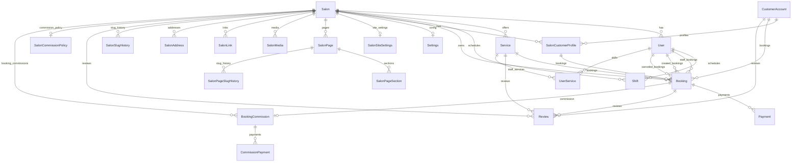

# Database (Prisma)

This document is generated from `prisma/schema.prisma` and is the source of truth for the data model.

## ERD (Mermaid)

## Enums

- `UserRole`: `MANAGER`, `RECEPTIONIST`, `STAFF`
- `BookingStatus`: `PENDING`, `CONFIRMED`, `DONE`, `CANCELED`, `NO_SHOW`
- `BookingSource`: `IN_PERSON`, `ONLINE`
- `PaymentMethod`: `CASH`, `CARD`, `ONLINE`
- `PaymentStatus`: `INITIATED`, `PENDING`, `PAID`, `FAILED`, `REFUNDED`, `VOID`, `CANCELED`
- `BookingPaymentState`: `UNPAID`, `PENDING`, `PARTIALLY_PAID`, `PAID`, `REFUNDED`, `OVERPAID`, `FAILED`, `CANCELED`
- `PageStatus`: `DRAFT`, `PUBLISHED`, `ARCHIVED`
- `PageType`: `HOME`, `ABOUT`, `SERVICES`, `GALLERY`, `TEAM`, `CONTACT`, `CUSTOM`
- `PageSectionType`: `HERO`, `RICH_TEXT`, `HIGHLIGHTS`, `SERVICES_GRID`, `STAFF_GRID`, `GALLERY_GRID`, `TESTIMONIALS`, `CONTACT_CARD`, `MAP`, `FAQ`, `CTA`
- `MediaType`: `IMAGE`, `VIDEO`
- `MediaPurpose`: `COVER`, `GALLERY`, `BEFORE_AFTER`, `LOGO`
- `LinkType`: `INSTAGRAM`, `WHATSAPP`, `TELEGRAM`, `WEBSITE`, `PHONE`, `GOOGLE_MAP`
- `ReviewTarget`: `SALON`, `SERVICE`
- `ReviewStatus`: `PUBLISHED`, `HIDDEN`, `DELETED`
- `RobotsIndex`: `INDEX`, `NOINDEX`
- `RobotsFollow`: `FOLLOW`, `NOFOLLOW`
- `CommissionType`: `PERCENT`, `FIXED`
- `CommissionStatus`: `PENDING`, `ACCRUED`, `CHARGED`, `WAIVED`, `REFUNDED`
- `CommissionPaymentMethod`: `CASH`, `CARD`, `ONLINE`, `TRANSFER`
- `CommissionPaymentStatus`: `PENDING`, `PAID`, `VOID`, `REFUNDED`
- `SessionActorType`: `USER`, `CUSTOMER`
- `OtpPurpose`: `LOGIN`, `SIGNUP`
- `OtpChannel`: `SMS`, `WHATSAPP`
- `IdempotencyStatus`: `IN_PROGRESS`, `COMPLETED`, `FAILED`
- `PaymentProvider`: `MANUAL`, `STRIPE`, `ZARINPAL`

## Models

### Salon

- Fields: `id`, `name`, `isActive`, `slug` (unique), `description`, `seoTitle`, `seoDescription`, `createdAt`, `updatedAt`
- Relations: `users`, `services`, `bookings`, `shifts`, `settings`, `customers`, `siteSettings`, `pages`, `media`, `links`, `addresses`, `slugHistory`, `reviews`, `commissionPolicy`, `bookingCommissions`, `Payment`
- Indexes: `@@index([slug])`

### Settings

- Fields: `salonId` (unique), `preventOverlaps`, `timeZone`, `workStartTime`, `workEndTime`, `allowOnlineBooking`, `onlineBookingAutoConfirm`, timestamps
- Relation: `salon`

### User

- Fields: `salonId`, `fullName`, `phone`, `passwordHash`, `phoneVerifiedAt`, `role`, `isActive`, public profile fields, timestamps
- Relations: `salon`, `shifts`, bookings relations (staff/creator/canceler), `userServices`
- Unique: `@@unique([salonId, phone])`
- Indexes: `@@index([salonId, role])`, `@@index([salonId, isActive])`, `@@index([salonId, isPublic])`

### Session

- Fields: `actorType`, `actorId`, `tokenHash` (unique), `revokedAt`, `expiresAt`, timestamps
- Indexes: `@@index([actorType, actorId, expiresAt])`

### PhoneOtp

- Fields: `phone`, `purpose`, `channel`, `codeHash`, `expiresAt`, `consumedAt`, `attempts`, `ip`, `userAgent`, `targetActorType`, `targetActorId`, `createdAt`
- Indexes: `@@index([phone, purpose, expiresAt])`, `@@index([phone, createdAt])`, `@@index([consumedAt])`, `@@index([targetActorType, targetActorId])`

### CustomerAccount

- Fields: `phone` (unique), `fullName`, `phoneVerifiedAt`, timestamps
- Relations: `profiles`, `bookings`, `reviews`
- Indexes: `@@index([phone])`

### SalonCustomerProfile

- Fields: `salonId`, `customerAccountId`, `displayName`, `note`, timestamps
- Relations: `salon`, `customerAccount` (onDelete: Cascade), `bookings`
- Unique: `@@unique([salonId, customerAccountId])`
- Indexes: `@@index([salonId, displayName])`, `@@index([customerAccountId])`

### Service

- Fields: `salonId`, `name`, `durationMinutes`, `price`, `currency`, `isActive`, timestamps
- Relations: `salon`, `bookings`, `reviews`, `userServices`
- Indexes: `@@index([salonId, isActive])`, `@@index([salonId, name])`

### UserService (Join)

- Composite PK: `@@id([userId, serviceId])`
- Relations: `user` (onDelete: Cascade), `service` (onDelete: Cascade)
- Indexes: `@@index([serviceId])`, `@@index([userId])`

### Shift

- Fields: `salonId`, `userId`, `dayOfWeek`, `startTime`, `endTime`, `isActive`, timestamps
- Relations: `salon`, `user`
- Unique: `@@unique([salonId, userId, dayOfWeek])`
- Indexes: `@@index([salonId, dayOfWeek])`

### Booking

- Fields: `salonId`, `customerProfileId`, `customerAccountId`, `serviceId`, `staffId`, `createdByUserId`, `startAt`, `endAt`, snapshots, `amountDueSnapshot`, `paymentState`, `status`, `source`, `note`, cancel fields, completion fields, timestamps
- Relations: `salon`, `customerProfile`, `customerAccount`, `service`, `staff`, `createdBy`, `canceledBy`, `payments`, `reviews`, `commission`
- Indexes: `@@index([salonId, startAt])`, `@@index([salonId, staffId, startAt])`, `@@index([salonId, status, startAt])`, `@@index([salonId, staffId, status, startAt, endAt])`, `@@index([customerAccountId, startAt])`, `@@index([customerProfileId, startAt])`, `@@index([salonId, paymentState, startAt])`

### Payment

- Fields: `salonId`, `bookingId`, `amount`, `currency`, `provider`, `providerPaymentId`, `providerCheckoutId`, `status`, `failureReason`, `rawProviderPayload`, `idempotencyKey`, `paidAt`, `method`, `referenceCode`, timestamps
- Relations: `salon` (onDelete: Cascade), `booking` (onDelete: Cascade)
- Unique: `@@unique([provider, providerPaymentId])`, `@@unique([salonId, idempotencyKey])`
- Indexes: `@@index([bookingId, paidAt])`, `@@index([status, paidAt])`

### Review

- Fields: `salonId`, `customerAccountId`, `bookingId`, `target`, `serviceId`, `rating`, `comment`, `status`, timestamps
- Relations: `salon`, `customerAccount`, `booking` (onDelete: Cascade), `service`
- Unique: `@@unique([bookingId, target, serviceId])`
- Indexes: `@@index([salonId, status, createdAt])`, `@@index([serviceId, status, createdAt])`, `@@index([bookingId])`, `@@index([customerAccountId, createdAt])`

### SalonCommissionPolicy

- Fields: `salonId` (unique), `type`, `percentBps`, `fixedAmount`, `currency`, `applyToOnlineOnly`, `minimumFeeAmount`, `isActive`, timestamps
- Relation: `salon`
- Indexes: `@@index([salonId, isActive])`

### BookingCommission

- Fields: `bookingId` (unique), `salonId`, `status`, `baseAmount`, `currency`, `type`, `percentBps`, `fixedAmount`, `commissionAmount`, `calculatedAt`, `chargedAt`, `note`, timestamps
- Relations: `booking` (onDelete: Cascade), `salon`, `payments`
- Indexes: `@@index([salonId, status, createdAt])`, `@@index([chargedAt])`

### CommissionPayment

- Fields: `commissionId`, `amount`, `currency`, `status`, `method`, `paidAt`, `referenceCode`, timestamps
- Relation: `commission` (onDelete: Cascade)
- Indexes: `@@index([commissionId, paidAt])`, `@@index([status, paidAt])`

### SalonSiteSettings

- Fields: `salonId` (unique), `logoUrl`, `faviconUrl`, default SEO/OG fields, `googleSiteVerification`, `analyticsTag`, `robotsIndex`, `robotsFollow`, timestamps
- Relation: `salon`

### SalonPage

- Fields: `salonId`, `slug`, `title`, `type`, `status`, `publishedAt`, SEO fields, `canonicalPath`, `robotsIndex`, `robotsFollow`, `structuredDataJson`, timestamps
- Relations: `salon`, `sections`, `slugHistory`
- Unique: `@@unique([salonId, slug])`
- Indexes: `@@index([salonId, status])`, `@@index([salonId, type])`, `@@index([salonId, publishedAt])`

### SalonPageSection

- Fields: `pageId`, `type`, `dataJson`, `sortOrder`, `isEnabled`, timestamps
- Relation: `page` (onDelete: Cascade)
- Indexes: `@@index([pageId, sortOrder])`, `@@index([pageId, isEnabled])`, `@@index([pageId, type])`

### SalonMedia

- Fields: `salonId`, `type`, `purpose`, `url`, `thumbUrl`, `altText`, `category`, `caption`, `sortOrder`, `isActive`, timestamps
- Relation: `salon`
- Indexes: `@@index([salonId, purpose, isActive, sortOrder])`, `@@index([salonId, category])`

### SalonLink

- Fields: `salonId`, `type`, `label`, `value`, `isPrimary`, `isActive`, timestamps
- Relation: `salon`
- Indexes: `@@index([salonId, type])`, `@@index([salonId, isPrimary])`, `@@index([salonId, isActive])`

### SalonAddress

- Fields: `salonId`, `title`, `province`, `city`, `district`, `addressLine`, `postalCode`, `lat`, `lng`, `isPrimary`, timestamps
- Relation: `salon`
- Indexes: `@@index([salonId])`, `@@index([salonId, isPrimary])`, `@@index([province])`, `@@index([city])`

### SalonSlugHistory

- Fields: `salonId`, `oldSlug`, `createdAt`
- Relation: `salon` (onDelete: Cascade)
- Unique: `@@unique([oldSlug])`
- Indexes: `@@index([salonId, createdAt])`

### SalonPageSlugHistory

- Fields: `pageId`, `oldSlug`, `createdAt`
- Relation: `page` (onDelete: Cascade)
- Indexes: `@@index([pageId, createdAt])`, `@@index([oldSlug])`

## Domain Notes

### OTP

- OTPs are stored in `PhoneOtp` with `purpose`, `channel`, hashed `codeHash`, expiration, and `consumedAt` fields.
- OTP verification is used for user login and salon selection (see `auth.service.ts`).

### Sessions

- Sessions are polymorphic via `SessionActorType` (`USER` or `CUSTOMER`).
- `Session.tokenHash` stores a hashed refresh token for secure storage.

### Booking + Payment

- `Booking` includes snapshot fields that capture service details at booking time.
- `Payment` records are tied to a booking; `Booking.paymentState` tracks overall payment state.

### CMS / SEO

- `SalonPage` + `SalonPageSection` power page builder with `dataJson` blobs.
- Site-wide SEO defaults are stored in `SalonSiteSettings`, while per-page SEO is stored on `SalonPage`.

### Commission

- Commission configuration lives in `SalonCommissionPolicy`.
- Commission per booking is stored in `BookingCommission` and payments in `CommissionPayment`.

## Known Gaps / TODO

- `Session` records are created for login flows, but there is no direct relation to `User`/`CustomerAccount` in the Prisma schema (by design). Documentation assumes actor lookup via `actorType`/`actorId`.

## Source of Truth

- `prisma/schema.prisma`
